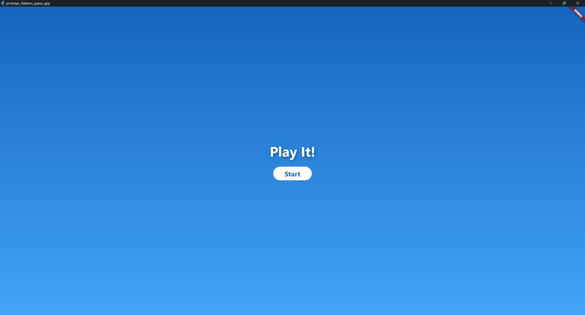

# Protoype-children-game-app

A simple prototype game built with Flutter, designed with a sensory-friendly approach for children. This game can be played on mobile phones, web, and desktop.

Currently, only two mini-games have been successfully developed:
- Color Matching
- Puzzle Game

## Result

### Home page

### Menu page

### Puzzle game

### Color matching game

## Under Development

For some mini-games that are not yet finished, you will see this page appear.

